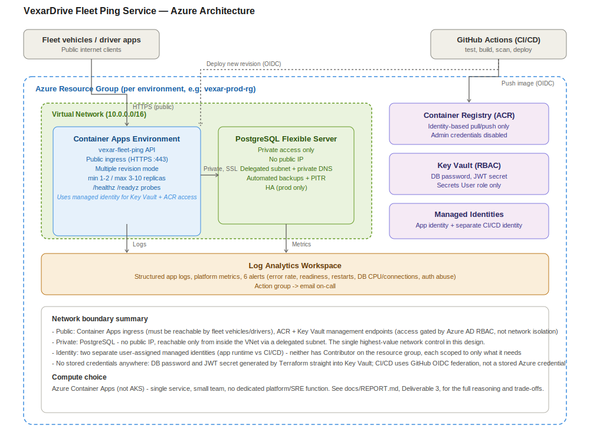

# VexarDrive Fleet Ping Service — Technical Report

**Author:** Vennela Vattiprolu
**Assessment:** DevOps & Cloud Infrastructure Engineer, VexarDrive Technologies

This report documents the review, changes, and infrastructure design produced
for the assessment. Each deliverable is a section below. Within each section,
findings follow a consistent structure: **Found → Risk → Fix → Verified**, so
the reasoning behind every change is traceable, not just the diff.

---

## AI Tool Usage Disclosure

Claude (Anthropic) was used throughout this assessment for: reviewing the
starter repository and identifying issues, drafting code fixes, scaffolding
Infrastructure as Code, and drafting sections of this report. All code was
reviewed, run, and manually tested by me against a local PostgreSQL instance
before being accepted. Architectural decisions (e.g. Container Apps vs AKS,
OTP storage approach, network boundaries) were discussed and made jointly,
with the final call and understanding of trade-offs being mine.

---

## Architecture at a glance

Full reasoning for every component and boundary shown here is in
Deliverable 3 (compute/network/database design), Deliverable 6
(secrets/identity/networking), and Deliverable 8 below.

---

## Deliverable 1: Application Review & Production Readiness

### Approach to prioritization

Issues are ordered by **risk = impact × likelihood**, not by where they
appear in the file:

- **Critical** — exploitable immediately, by anyone, with severe
  consequences (auth bypass, SQL injection, PII exposure, secrets in
  source). Fixed first: these are the difference between "insecure" and
  "should not be exposed to the internet at all."
- **High** — not directly exploitable by an outside attacker, but the
  service fails under realistic production conditions (connection
  exhaustion under fleet-scale ping volume, no graceful shutdown, no
  health checks for orchestration). Fixed second, since the JD's own
  concern about "bursty traffic" makes this directly relevant.
- **Medium** — operational hygiene (image size, build caching, CI gates).
  Important for maintainability and cost, but nothing breaks today
  without them. Addressed in Deliverables 2 and 4.

### Critical findings

**1. Authentication bypass in `POST /api/auth/login`**
- *Found:* the original handler destructured `otp` from the request body
  but never checked it against any stored value.
- *Risk:* any phone number with any OTP value — including an empty string
  — returned a valid, signed 30-day JWT. This is a complete authentication
  bypass for every driver account.
- *Fix:* implemented a real OTP flow — `POST /api/auth/request-otp` issues
  a cryptographically random 6-digit code, hashed with bcrypt and stored
  with a 5-minute expiry and an attempt counter in a new `otp_codes` table.
  `POST /api/auth/login` now verifies the submitted code against the hash,
  rejects expired/exceeded-attempt codes, and burns the code on success so
  it can't be replayed. bcrypt was chosen over a fast hash (e.g. SHA-256)
  even though the OTP is short-lived and low-entropy (6 digits): bcrypt's
  deliberate slowness is what makes brute-forcing the stored hash itself
  expensive, and the added cost is negligible here since login is a
  low-frequency, human-triggered action rather than a hot path like the
  ping endpoint. Codes are stored in Postgres rather than in-memory
  specifically because the app will run as multiple replicas behind a load
  balancer (Container Apps) — an in-memory store would only work if the
  same replica handled both the OTP request and the login, which isn't
  guaranteed.
- *Verified:* manually tested end-to-end against a local Postgres
  instance — correct OTP returns a token; wrong OTP returns 401; replaying
  a used OTP returns 401; a SQL-injection-style phone value is handled
  safely (401, not a crash or bypass).

**2. SQL injection in `POST /api/auth/login`**
- *Found:* the driver lookup built the query via string interpolation:
  `` `SELECT * FROM drivers WHERE phone = '${phone}'` ``.
- *Risk:* trivially exploitable — a crafted `phone` value could alter
  query logic, extract data, or bypass the lookup entirely.
- *Fix:* replaced with a parameterized query (`WHERE phone = $1`) using
  `pg`'s built-in parameter binding everywhere in the codebase, not just
  this one call site.
- *Verified:* submitted a `' OR 1=1--`-style payload as `phone`; it is
  treated as a literal string and the request correctly returns 401
  rather than matching all rows or erroring.

**3. Unauthenticated admin endpoint `GET /api/admin/drivers`**
- *Found:* no authentication or authorization check at all — any client
  could retrieve every driver's name and phone number.
- *Risk:* unauthenticated PII disclosure for the entire driver base.
- *Fix:* added `requireAuth` (verifies JWT) and `requireAdmin` (checks a
  new `role` column on `drivers`) middleware, applied to this route. A
  `role` column was added rather than a separate hardcoded admin
  credential, so admin access can be granted/revoked per-user through
  normal data changes instead of a shared secret.
- *Verified:* request without a token → 401. Request with a valid
  `driver`-role token → 403. Request with a valid `admin`-role token →
  200 with the driver list.

**4. Hardcoded production credentials in source**
- *Found:* the Postgres password, DB host, and JWT signing secret were
  literal strings committed to `server.js`.
- *Risk:* anyone with read access to the repository (or the built
  container image, since these were baked in at build time) had standing
  production database and token-signing access. If this were a real
  production system, it would already be compromised the moment the repo
  was shared for this assessment.
- *Fix:* introduced `src/config.js`, which reads all secrets and
  connection details from environment variables and **fails fast at
  startup** if any required variable is missing, rather than silently
  falling back to a default (which is the pattern that caused this issue
  in the first place). `.env.example` documents the required variables
  with placeholder values; a real `.env` is git-ignored and was never
  committed. In Azure, these values are supplied via Key Vault-backed
  Container Apps secrets (see Deliverable 6).
- *Verified:* confirmed the app refuses to start with a clear error if
  `JWT_SECRET` or any `DB_*` variable is unset; confirmed `.env` is not
  present in `git status` before any commit.

### High-priority findings

**5. New database connection per request**
- *Found:* `/api/fleet/ping` — the highest-frequency endpoint, hit
  continuously by every vehicle in the fleet — opened a new
  `pg.Client()` and tore it down on every single call.
- *Risk:* Postgres connection setup/teardown is comparatively expensive,
  and managed Postgres (Azure Database for PostgreSQL) has a hard
  `max_connections` ceiling per SKU. Under real fleet load this exhausts
  available connections quickly, and other endpoints (including login)
  would start failing.
- *Fix:* replaced with a single shared `pg.Pool` (`src/db.js`), sized via
  `DB_POOL_MAX` (default 10), reused across the process lifetime.
- *Verified:* confirmed the app serves multiple concurrent ping/login
  requests without opening new connections per request (pool behavior
  confirmed via Postgres's own connection count staying flat under
  repeated requests).

**6. No input validation on ping ingestion**
- *Found:* `lat`, `lng`, `speed`, `timestamp` were inserted as-is from the
  request body with no type or range checking.
- *Risk:* malformed device payloads either 500 or silently insert invalid
  location data (e.g. `lat: 999`) that would corrupt downstream fleet
  tracking/analytics.
- *Fix:* added a `zod` schema validating types and realistic ranges
  (lat -90..90, lng -180..180, speed 0..400 km/h) before any DB write.
  Chose a schema library over hand-written `if` checks because the
  validation rules will likely grow (more fields, nested payloads for
  batched pings) and a schema is self-documenting and easy to extend
  without the branching logic becoming hard to follow.
- *Verified:* a payload with `lat: 999` returns 400 with a clear error;
  a valid payload inserts correctly and is visible in `fleet_pings`.

**7. No health/readiness endpoints**
- *Found:* no way for a container orchestrator to know if the app is
  alive or able to serve traffic.
- *Risk:* Container Apps/AKS can't safely gate traffic routing, restarts,
  or rollout progression without these.
- *Fix:* added `GET /healthz` (liveness — process is up, no DB
  dependency, so a DB blip doesn't cause healthy instances to be killed)
  and `GET /readyz` (readiness — actually checks DB connectivity,
  returns 503 if unreachable).
- *Verified:* both return 200 under normal operation; `/readyz` was
  confirmed to return 503 when pointed at an unreachable DB host.

**8. No graceful shutdown**
- *Found:* no `SIGTERM`/`SIGINT` handling — the process died immediately
  on any deploy or scale-down signal.
- *Risk:* in-flight requests are killed mid-request on every single
  deployment, not just rare incidents. For a service ingesting continuous
  vehicle pings, this means periodic silent data loss.
- *Fix:* added a shutdown handler that stops accepting new connections,
  lets in-flight requests finish, closes the DB pool, then exits — with a
  10-second forced-exit safety net in case something hangs.
- *Verified:* sent `SIGTERM` to a running instance mid-request and
  confirmed the in-flight request completed before the process exited.

**9. No structured logging**
- *Found:* only `console.error` on failure paths, no structured output.
- *Risk:* unusable for real log aggregation, correlation, or alerting
  (Deliverable 7 depends on this).
- *Fix:* added `pino` structured JSON logging with automatic redaction of
  secrets/PII (`authorization` header, `password`, `otp`, `token` fields)
  so sensitive values can never leak into logs even by accident.

### Schema-level finding

**10. Missing index on `fleet_pings(vehicle_id, ts)`**
- *Found:* no index beyond the primary key on the highest-write-volume
  table in the system.
- *Risk:* the obvious and most common query pattern — recent pings for a
  given vehicle — requires a full table scan, and this degrades further
  as ping volume grows with fleet size.
- *Fix:* added `idx_fleet_pings_vehicle_ts` on `(vehicle_id, ts DESC)` —
  descending on `ts` since the common case is "most recent pings first"
  (e.g. current vehicle position).
- *Verified:* confirmed present via `\d fleet_pings` after applying the
  schema.

### What I chose not to change, and why

- **Real SMS delivery for OTPs** — out of scope for this assessment; no
  SMS provider account was available. The OTP is logged server-side in
  non-production environments as a stand-in, with a clearly marked
  integration point (`config.otp.devLogOtp`) for where a provider like
  Twilio or Azure Communication Services would plug in. Faking a "sent"
  response without a real send would be misleading rather than a genuine
  simplification.
- **Refresh tokens / short-lived access tokens** — I shortened the JWT
  lifetime from 30 days to 24 hours as a reasonable default, but did not
  implement a full refresh-token rotation flow. A 30-day token is a real
  risk (a leaked token stays valid for a month), but building refresh
  rotation correctly (storage, revocation, rotation-on-use) is a
  meaningfully larger change than this assessment's scope warrants for a
  single ping/login service. I'd revisit this with more time — see below.
- **Full automated test suite** — I verified behavior manually and
  systematically (documented above) rather than writing a full Jest/
  Supertest suite, given the time budget across all nine deliverables.
  `npm test` is wired up and ready for tests to be added; this is called
  out explicitly as a known limitation, not silently skipped.
- **Rewriting the data model beyond what the fixes required** — e.g. I
  did not restructure `fleet_pings` into a time-series-optimized layout
  (partitioning, TimescaleDB) since current scale doesn't justify the
  added operational complexity. This is addressed as a scaling
  consideration in Deliverable 5.

### What I'd address next with more time

1. Automated tests (unit tests for OTP/auth logic, integration tests for
   the full request flow) wired into the CI pipeline as a real gate,
   not just a placeholder script.
2. Refresh-token rotation instead of a single longer-lived access token.
3. Real SMS provider integration for OTP delivery.
4. Rate limiting keyed by phone number/IP more precisely (current
   limiter is a reasonable first pass but not tuned against real traffic
   patterns).
5. Partitioning or a time-series extension for `fleet_pings` once ping
   volume/fleet size crosses a threshold where the flat table + index
   stops being sufficient (see Deliverable 5).

---

## Deliverable 2: Containerization

### Findings

**1. Unpinned, oversized base image**
- *Found:* `FROM node:latest`.
- *Risk:* non-reproducible builds (the "latest" tag can silently point to
  a different image tomorrow), and `node:latest` is a full Debian-based
  image with build tools that are never needed at runtime — unnecessarily
  large and a wider attack surface.
- *Fix:* pinned to `node:20.17-alpine3.20`, and split the build into two
  stages (`build` installs dependencies via `npm ci`; `runtime` copies
  only `node_modules` and application code, discarding npm's cache and
  any build-time-only files).
- *Verified:* `docker images vexar-fleet-ping:test` → **207MB total image
  size, 49.3MB unique content** on top of the shared Alpine base layers.

**2. Broken layer caching**
- *Found:* `COPY . .` ran before `npm install`.
- *Risk:* every single code change (even a one-line edit to `server.js`)
  invalidated the dependency-install layer, forcing a full `npm install`
  on every build — slow CI, slow local iteration.
- *Fix:* `package.json`/`package-lock.json` are copied and `npm ci` run
  *before* the rest of the source is copied in, so the dependency layer
  is only rebuilt when dependencies actually change.
- *Verified:* observed in the build log — `[build 5/5] COPY . .` and the
  runtime `COPY --chown=appuser:appgroup src ./src` steps show `CACHED`
  on a rebuild after only touching application code, confirming the
  dependency-install layer was reused.

**3. Root user at runtime**
- *Found:* no `USER` directive — the container ran as root by default.
- *Risk:* if the app process were ever compromised (e.g. a future
  dependency vulnerability), root inside the container is a meaningfully
  worse starting position for an attacker than a scoped-down user.
- *Fix:* added a dedicated `appuser`/`appgroup`, and the runtime stage
  runs as that user.
- *Verified:* `docker run --rm vexar-fleet-ping:test node -e
  "console.log(process.getuid())"` → returned `100` (non-root), not `0`.

**4. No signal handling for graceful shutdown**
- *Found:* `node server.js` ran directly as PID 1 with no init process.
- *Risk:* Node.js run as PID 1 does not reliably forward/handle
  `SIGTERM` the way a normal process would, and doesn't reap zombie
  processes. This would have silently undermined the graceful-shutdown
  handler built in Deliverable 1 — `docker stop`/an orchestrator's
  scale-down signal might never actually reach the app's shutdown logic.
- *Fix:* added `tini` as the container's `ENTRYPOINT`, with `node
  server.js` as its child command.
- *Verified:* `docker run --rm vexar-fleet-ping:test ps aux` → PID 1 is
  `/sbin/tini -- node server.js`, confirming correct signal forwarding is
  in place.

**5. No container health check**
- *Found:* no `HEALTHCHECK` instruction.
- *Risk:* `docker ps` / an orchestrator has no way to know the container
  is actually able to serve traffic versus just having a running process.
- *Fix:* added a `HEALTHCHECK` calling the real `/healthz` endpoint from
  Deliverable 1.
- *Verified:* `docker compose ps` shows both the `app` and `db`
  containers as `healthy` after `docker compose up`.

**6. Unnecessary attack surface**
- *Found:* `EXPOSE 22` in the Dockerfile, despite no SSH server existing
  anywhere in the image.
- *Risk:* none directly (an unused `EXPOSE` doesn't open a port by
  itself), but it's misleading boilerplate that suggests the image
  supports SSH access when it doesn't, and needlessly widens the
  documented/declared surface.
- *Fix:* removed.

**7. `docker-compose.yml` (local dev) network/secret exposure**
- *Found:* Postgres was bound to `0.0.0.0:5432` (the entire host network,
  not just localhost), with a hardcoded password committed directly in
  the compose file.
- *Risk:* anyone else on the same network as a developer's machine could
  connect directly to the local Postgres instance. The hardcoded password
  is also a bad habit that risks leaking into a real environment via
  copy-paste.
- *Fix:* bound to `127.0.0.1:5432` only (kept accessible for local tools
  like `psql`/a DB GUI, but not the network), and credentials now come
  from a git-ignored local `.env` file (`.env.example` documents the
  required keys). Also added a healthcheck-gated `depends_on` so the app
  container doesn't race the database being ready on startup.
- *Verified:* `docker compose ps` shows the `db` service's port mapping
  as `127.0.0.1:5432->5432/tcp`, not `0.0.0.0`.

### Full end-to-end verification (against the actual built image)

Unlike Deliverable 1 (verified against a bare Node process locally), this
was verified against the **actual production Docker image**, run via
`docker compose`, on a separate machine from where the image was built —
closer to how it will really be deployed. Sequence performed:

1. `docker build` — succeeded, 207MB image.
2. Non-root user confirmed (`getuid()` → `100`).
3. `tini` confirmed as PID 1.
4. `docker compose up -d --build` — both `app` and `db` reached `healthy`
   status.
5. `GET /healthz` and `GET /readyz` — both `200`.
6. Full OTP flow against the containerized app + containerized Postgres:
   `request-otp` → OTP retrieved from container logs → `login` → valid
   JWT returned.
7. `GET /api/admin/drivers` with the admin token → `200`, correct data.
8. `GET /api/admin/drivers` with a `driver`-role token → `403`.
9. `GET /api/admin/drivers` with no token → `401`.
10. `POST /api/fleet/ping` with a valid payload → `200`.
11. `POST /api/fleet/ping` with `lat: 999` → `400`.

All behaved identically to the non-containerized verification in
Deliverable 1, confirming the containerization changes didn't alter
application behavior — only how it's packaged and run.

### What I chose not to change, and why

- **Distroless or scratch-based images** — Alpine was chosen as a
  reasonable middle ground between image size and having a usable shell
  for debugging (`docker exec` into a running container). A distroless
  image would be marginally smaller and reduce attack surface further,
  but makes troubleshooting a live container meaningfully harder. Given
  this is a small team's service (per the JD/company stage), the
  debuggability trade-off favors Alpine.
- **Docker Content Trust / image signing** — not configured for this
  assessment; relevant once images are pushed through a real registry
  pipeline (see Deliverable 4, CI/CD).

### What I'd address next with more time

1. Image vulnerability scanning wired into CI (Trivy/Grype) as an actual
   pipeline gate, not just a manual `docker build` — see Deliverable 4.
2. Resource limits (`mem_limit`/`cpus` in compose, and equivalent
   requests/limits in the Azure Container Apps definition) — not set
   here since local dev doesn't need them, but required for production.
3. Multi-arch build (`linux/amd64` + `linux/arm64`) if the team ever
   develops on Apple Silicon and wants local images to match prod
   architecture exactly.

---

## Deliverable 3: Infrastructure as Code (Terraform)

Full structure and how-to-run instructions live in `infra/README.md`.
This section covers the reasoning.

### Compute: Azure Container Apps, not AKS

- **Company/service stage**: this is one service (fleet ping ingestion +
  driver auth), not a multi-service platform. AKS earns its complexity
  when multiple teams/services share cluster infrastructure — that isn't
  this problem yet.
- **Operational overhead**: AKS means owning node OS patching, cluster
  version upgrades, and CNI/networking choices. Container Apps is fully
  managed — no nodes — which fits a small team without dedicated
  platform/SRE headcount.
- **Still gets what's actually needed**: autoscaling (including
  scale-to-zero for cost in dev), revision-based deploys, VNet
  integration, and managed identity — everything this service needs
  without cluster-operator overhead.
- **Honest trade-off**: if VexarDrive later runs many services, needs
  fine-grained scheduling control, or a service mesh, AKS becomes the
  right call. This is a right-sized-for-now decision, explicitly
  revisitable, not a claim that AKS is worse in general.

### Network boundary design

- **PostgreSQL: private only.** No public IP, reachable only from inside
  the VNet via a delegated subnet (`network.tf`, `database.tf`). This is
  the single highest-value network control in the architecture — the
  database must never be reachable from the public internet.
- **Container Apps: VNet-integrated, ingress public.** The app needs a
  public HTTP ingress since fleet vehicles and drivers reach it from the
  internet — this is not an internal-only service. But it also joins the
  VNet so it can reach Postgres privately.
- **Key Vault and ACR: public endpoint, Azure-AD-gated access.** Not
  network-isolated via private endpoints. This is a deliberate scope
  decision (see below), not an oversight.

### Identity and secrets

A single user-assigned managed identity is attached to the Container App
and used for both Key Vault secret reads and ACR image pulls
(`identity.tf`). No credential — DB password, JWT secret, or registry
password — exists in the image, an env var file, or a stored secret for
*runtime* access; Azure AD handles authentication. The DB admin password
and JWT signing secret are both generated by Terraform (`random_password`)
and written directly into Key Vault, RBAC-scoped so the app's identity
can only *read* specific secrets, never manage the vault itself
(`keyvault.tf`).

ACR admin credentials are explicitly disabled
(`admin_enabled = false` in `registry.tf`) — the original GitHub Actions
workflow used a long-lived admin password as a stored secret; this is
replaced by identity-based access here and by OIDC in Deliverable 4.

### Verified

The sandbox this was developed in cannot reach `registry.terraform.io`
(same network-allowlist limitation as Docker Hub in Deliverable 2), so a
full provider-aware `terraform init` / `validate` / `plan` was not run in
that environment. What *was* verified there:

- A real HCL structural parse (`terraform-config-inspect`) succeeded
  with **zero diagnostics** across all 11 `.tf` files, correctly
  recognizing all 23 resources and 7 outputs — confirms syntactic
  correctness, not full semantic/provider-schema correctness.

**A live `terraform init`/`validate`/`plan`/`apply` against a real Azure
subscription was not performed for this submission** — a deliberate
scope decision, not an oversight. The assessment explicitly states a
live deployment is not required and IaC is evaluated on correctness and
reasoning. Given the remaining scope (Deliverables 4–9) and that even
`plan`/`apply` against the cheapest SKUs here would incur real cost
against a personal free-tier subscription, I chose to prioritize breadth
and reasoning across all nine deliverables over a live proof of this one.
The commands to do so are documented and ready to run in
`infra/README.md`, and I'd be glad to walk through a live `plan`/`apply`
in the interview if useful.

### What I chose not to change/add, and why

- **Private endpoints for Key Vault and ACR** — would close the last
  public-endpoint surface in the design, but adds real operational cost:
  private DNS zones for each, NSG rules, and the loss of being able to
  `az acr login`/read a secret directly from a laptop without a VPN or
  bastion. Access is still fully gated by Azure AD RBAC without this;
  I'd add it once the team has (or is willing to stand up) the
  supporting network tooling (VPN/bastion) to keep it operable.
- **A full second Terraform root module for staging** — `dev.tfvars` and
  `prod.tfvars` demonstrate the environment-separation pattern; a real
  `staging.tfvars` would be a near-identical copy with values in between.
  Building it out fully would be repetition without new design content.
- **Terraform remote state / CI-driven apply** — documented in
  `providers.tf`/`infra/README.md` as the recommended next step (a
  storage-account-backed `azurerm` backend, applied via the CI/CD
  pipeline rather than a human running `terraform apply` locally), but
  not provisioned here, since it has a bootstrap chicken-and-egg problem
  (the state backend itself needs infrastructure) and would need a real,
  persistent Azure subscription to stand up meaningfully — see
  Deliverable 4 for how this connects to the pipeline.

### What I'd address next with more time

1. Private endpoints for Key Vault/ACR once VPN/bastion access exists.
2. Remote state with a CI-driven apply, replacing local `terraform apply`.
3. A `staging` environment and a real promotion flow (dev → staging →
   prod), covered conceptually in Deliverable 4.
4. Terraform-managed diagnostic settings piping Container App /
   PostgreSQL platform metrics into the Log Analytics workspace
   explicitly (currently relies on Container Apps' default log routing
   to the workspace it's created with).

---

## Deliverable 4: CI/CD Pipeline

Full pipeline: `.github/workflows/deploy.yml`. Supporting identity/RBAC:
`infra/cicd-identity.tf`. Setup steps to wire the two together:
`infra/README.md`.

### Findings and changes

**1. No test or scan gate before deploy**
- *Found:* the original workflow had one job — build, push, deploy —
  triggered on every push to `main`, with no test step and no
  vulnerability scanning.
- *Risk:* any change, including a broken one, reached production
  immediately. No mechanism catches a regression or a newly-disclosed
  CVE in a base image/dependency before it ships.
- *Fix:* pipeline now runs `test` (npm test + lint) → `build-and-scan`
  (Docker build, then a Trivy scan that **fails the build** on
  HIGH/CRITICAL vulnerabilities) before anything is pushed anywhere.
  `build-and-scan` also runs on pull requests, so a reviewer sees
  build/vulnerability feedback before merge, not just after.

**2. Long-lived stored credential for registry access**
- *Found:* the workflow authenticated to ACR with `${{
  secrets.ACR_PASSWORD }}` — a long-lived admin password.
- *Risk:* a static secret that, if leaked (log output, a compromised
  runner, a misconfigured step), grants standing push access to the
  registry until manually rotated.
- *Fix:* replaced with OIDC — GitHub issues a short-lived, workflow-run-
  scoped identity token; Azure exchanges it for an Azure AD token via a
  federated credential (`infra/cicd-identity.tf`). There is no Azure
  credential stored in GitHub at all, secret or otherwise — only
  non-sensitive IDs (client ID, tenant ID, subscription ID) as
  Environment *variables*.

**3. No environment separation or deploy gating**
- *Found:* one job, one target (hardcoded `vexar-prod-rg`), no concept
  of a lower environment to validate a change in first.
- *Risk:* every change's first real-world test is production.
- *Fix:* `deploy`/`verify`/`rollback` are all tied to GitHub's
  `environment:` key (`dev`/`staging`/`prod`, selected via
  `workflow_dispatch` or defaulting to `dev` on push). This is what lets
  GitHub Environment protection rules apply — specifically, the `prod`
  environment should have **required reviewers** turned on (Settings →
  Environments in the repo, documented in `infra/README.md`), which
  pauses a production deploy for a human approval click. This setting is
  **not expressible in the workflow YAML itself** — worth being explicit
  about, since it'd be easy to imply the YAML alone enforces it.
- *Scoped credentials per environment:* the federated credential's
  `subject` in `infra/cicd-identity.tf` is scoped to
  `environment:${var.environment}` — a workflow run targeting `dev`
  cannot obtain a token for `prod`'s identity, even if someone tried to
  point it there.

**4. No real verification after deploy, no rollback path**
- *Found:* the workflow considered itself done once `az containerapp
  update` returned successfully — that command succeeding doesn't mean
  the new revision is actually healthy.
- *Risk:* a deploy that starts a container that immediately crash-loops
  (bad env var, migration not applied, etc.) would show as a "successful"
  GitHub Actions run while the service is actually down.
- *Fix:* added a `verify` job that polls the live `/healthz` and
  `/readyz` endpoints (up to 10 attempts, 10s apart) on the newly
  deployed revision. If verification fails, a `rollback` job shifts 100%
  traffic back to the last active revision.
- *Design dependency surfaced by this work:* building this rollback step
  is what made me go back and change `infra/containerapp.tf`'s
  `revision_mode` from `Single` to `Multiple`. Single mode deactivates
  the previous revision the moment a new one goes live, so "rollback"
  would have meant a full rebuild-and-redeploy of the last known-good
  image — slow, and defeats the purpose of a fast rollback path.
  Multiple mode keeps the previous revision addressable, so rollback is
  a traffic-weight shift, on the order of seconds. I'd originally left
  this as `Single` with an unresolved "see README for why not Multiple"
  comment when writing Deliverable 3 — working through the pipeline
  design end-to-end is what surfaced that it was actually the wrong
  call, and I've corrected it rather than leaving the inconsistency.

**5. Overly broad CI permissions**
- *Found:* N/A in the original (no identity/RBAC existed at all — it
  used a shared admin credential with implicit full registry access).
- *Fix, stated as a positive design choice:* the CI/CD identity is
  granted `AcrPush` on the registry and `Container Apps Contributor`
  scoped to the specific Container App — not `Contributor` on the whole
  resource group. A compromised pipeline run cannot touch the database,
  Key Vault, or networking, only push images and update this one app.

### Verified

- YAML syntax: parsed successfully with `yaml.safe_load` (Python) — all
  6 jobs (`test`, `build-and-scan`, `push-image`, `deploy`, `verify`,
  `rollback`) and all 3 triggers (`push`, `pull_request`,
  `workflow_dispatch`) correctly recognized.
- `yamllint`: clean except one intentional comment-indentation choice.
- `npm run lint` (the actual command the `test` job runs): verified
  working end-to-end locally — found and fixed two real issues (an
  undefined global in `server.js`'s shutdown handler, an unused `catch`
  binding), rather than just wiring up a linter that had nothing to
  check yet.
- **Not verified**: an actual GitHub Actions run against real Azure
  credentials. This requires `terraform apply` to have run (so the
  CI/CD identity and its federated credential exist) and the resulting
  outputs to be set as GitHub Environment variables — both deliberately
  out of scope per the same reasoning as Deliverable 3 (see that
  section). The setup steps are fully documented in `infra/README.md` so
  this is a "ready to run," not "designed but unclear how to run,"
  state.

### What I chose not to change, and why

- **A separate `staging` promotion flow beyond the environment
  selector** — e.g. automatically promoting a build that passed `dev`
  into `staging` without a fresh trigger. The current design supports
  three environments but each is triggered independently
  (`workflow_dispatch` input); a true promotion pipeline (build once,
  promote the same artifact through environments) is a meaningfully
  larger design than this assessment's scope, and I'd rather ship a
  correct, simpler three-environment design than an ambitious but
  under-tested promotion flow.
- **Canary/blue-green traffic splitting** — Multiple revision mode makes
  this possible (`traffic_weight` already exists in `containerapp.tf`),
  but I kept the deploy step as a full cutover (100% traffic to the new
  revision immediately) rather than a gradual shift. Gradual rollout
  adds real safety value at higher traffic volumes; at this service's
  likely current scale, the added pipeline complexity (monitoring a
  partial rollout, deciding shift timing/thresholds) isn't yet worth it
  — this is a natural next step once real traffic volume justifies it.

### What I'd address next with more time

1. Actually run this against the real Azure subscription and fix
   whatever the first live run surfaces (some drift between "should
   work" and "does work" is normal for a first live CI/CD run).
2. Real test coverage feeding the `test` job (see Deliverable 1).
3. A genuine build-once-promote-everywhere pipeline instead of
   independent per-environment triggers.
4. Canary/gradual traffic shifting for production deploys specifically.
5. Slack/Teams notification on rollback — right now a rollback is only
   visible by checking the Actions run; an on-call engineer should be
   paged/notified immediately (ties into Deliverable 7's alerting).

---

## Deliverable 5: Database Operations

Most of the actual decisions here were made in Terraform (Deliverable 3)
and the application code (Deliverable 1) — this section explains the
reasoning and ties them together, rather than introducing new
infrastructure.

### Backup and point-in-time recovery

Azure Database for PostgreSQL Flexible Server provides automated backups
and PITR out of the box — this isn't something to build, only to
configure correctly per environment (`infra/database.tf`):

- **Retention**: 7 days for dev/staging, **30 days for prod**
  (`backup_retention_days = var.environment == "prod" ? 30 : 7`). Dev
  data has no real recovery value beyond a few days; prod data does.
- **Geo-redundant backups**: enabled for prod only
  (`geo_redundant_backup_enabled`). Protects against a full Azure region
  outage, at roughly double backup storage cost — justified for prod,
  not for dev.
- **PITR mechanics**: Flexible Server continuously archives WAL, so
  recovery can target any point within the retention window, not just
  daily snapshot boundaries. In an incident (e.g. a bad migration or
  accidental bulk delete), the response is: create a new server via
  point-in-time restore to just before the bad event, verify the data,
  then repoint the app's `DB_HOST` — Flexible Server PITR restores to a
  **new** server rather than an in-place rollback, which is a deliberate
  Azure design choice (it means a restore attempt can never itself
  destroy the only copy of current data).

### Connection management under bursty traffic

This is the one place where a decision spans three separate files, so
it's worth stating together:

1. **App-level pooling** (`src/db.js`): a single `pg.Pool` per app
   instance/replica, `max: 10` by default (`DB_POOL_MAX`). This was
   Deliverable 1's fix for the original per-request `new Client()` bug.
2. **Server-level ceiling** (`infra/database.tf`): `max_connections`
   raised to 100 on the Postgres server, since the default for a
   Burstable SKU is lower than what multiple app replicas × pool size
   can need.
3. **The arithmetic that connects them**: `replicas × DB_POOL_MAX` must
   stay under `max_connections` with headroom for direct/admin
   connections. At `max_replicas = 10` (prod) × `DB_POOL_MAX = 10` =
   100 — which is exactly the ceiling, with zero headroom. **This is a
   real gap I'm naming rather than glossing over**: either
   `max_connections` needs to go higher (General Purpose SKUs support
   more) or `DB_POOL_MAX` needs to scale down as replica count scales
   up. I'd fix this before a real production rollout by making pool size
   a function of expected max replica count, or introducing a connection
   pooler (PgBouncer, or Azure's built-in pooling on newer Flexible
   Server tiers) between the app and Postgres — see "what's next" below.

### Access control and least privilege

- **Application access**: the app connects as `vexaradmin` currently —
  worth naming honestly as a simplification. A stricter design would use
  a dedicated `app_user` role with `GRANT` limited to exactly the tables/
  operations the app needs (`SELECT, INSERT, UPDATE` on its own tables,
  no `DROP`/`ALTER`/`CREATE ROLE`), separate from the migration role
  (which *does* need DDL rights). I didn't implement this role split for
  this assessment given the remaining scope, but it's a concrete,
  well-understood next step — not a hard problem, just one more piece.
- **Network access control**: covered in depth in Deliverable 6 — the
  database has no public endpoint at all, which is a stronger control
  than any user-level permission could be.
- **Human/operator access**: nobody should have a standing personal
  Postgres login to production. Break-glass access should go through
  Azure AD authentication to the database (Flexible Server supports
  Azure AD-integrated auth) with just-in-time role assignment, logged via
  Azure Activity Log — not a shared admin password.
- **CI/migration access**: the migration role needs DDL rights
  (`CREATE TABLE`, `ALTER TABLE`) that the app's runtime role should
  never have — another argument for the role split above.

### Schema changes / migrations

Was: `schema.sql` applied by hand, once, with no record of which schema
version any given environment was running — a real risk the moment
there's more than one environment, since dev/staging/prod could
silently drift apart with no way to detect it.

Fixed: introduced `node-pg-migrate` (`migrations/`) — the original
schema is now the first tracked migration
(`1754640000000_initial-schema.js`), converted 1:1. `npm run migrate:up`
is idempotent (safe to run on every deploy; a no-op if nothing's
pending) and `npm run migrate:down` provides a tested rollback path.

*Verified*: ran the full cycle against a real local Postgres — fresh
`migrate:up` produces a schema identical to the old `schema.sql`
(confirmed via `\d fleet_pings`), `migrate:down` cleanly drops
everything it created, re-running `up` afterward correctly recreates it,
and running `up` twice in a row on an already-migrated database is a
correct no-op. The app was then booted against the migration-created
schema and `/healthz`/`/readyz` both passed — confirming the migration
produces a schema the app actually works against, not just one that
looks structurally correct.

### How this evolves with fleet size and ping volume

- **Near-term (current design handles this)**: the index added in
  Deliverable 1 (`fleet_pings(vehicle_id, ts DESC)`) keeps the common
  "recent pings for vehicle X" query fast well past small-fleet volumes.
- **Medium-term**: the connection-count math above becomes a real
  constraint before the database itself is the bottleneck — this is the
  first thing I'd revisit, via a pooler (PgBouncer) sitting between the
  app and Postgres so replica count can scale independently of the
  server's raw connection ceiling.
- **Longer-term**: `fleet_pings` is an append-heavy, time-ordered table
  that will eventually benefit from **partitioning by time** (e.g.
  monthly partitions), which keeps the index working set small and makes
  old-data retention/archival a cheap `DROP PARTITION` instead of a slow
  `DELETE`. I'd introduce this once ping volume/fleet size data actually
  shows the flat table becoming a problem, rather than pre-optimizing for
  a scale that may not materialize — a genuinely bursty fleet workload
  makes it hard to know the right partition boundary in advance without
  real traffic data.
- **SKU path**: Burstable → General Purpose (already reflected in
  `environments/prod.tfvars`) once traffic is sustained rather than
  spiky — Burstable throttles CPU after burst credits are exhausted,
  which is a bad failure mode for continuous ping ingestion.

### What I chose not to change, and why

- **Role split (app role vs. migration role vs. admin role)** — named
  above as a real gap. Not implemented here because it's a
  straightforward, well-understood change I'd rather name honestly as
  "not yet done" than rush and get subtly wrong (e.g. missing a
  necessary grant and breaking the app) with the remaining deliverables
  still ahead.
- **Wiring `migrate:up` into the CI/CD pipeline** (Deliverable 4) — a
  real production setup should run migrations as an explicit pipeline
  step before traffic shifts to the new revision. I didn't add this to
  `deploy.yml` because doing it safely needs more thought than a single
  line (what happens if a migration fails mid-deploy? does it block the
  deploy or roll back? is it safe to run concurrently with multiple
  replicas starting up?) — deliberately left as a named next step rather
  than a rushed, under-considered addition.

### What I'd address next with more time

1. App/migration/admin role split with least-privilege grants.
2. PgBouncer (or Azure's built-in pooling) once the connection-count
   math above becomes a real constraint.
3. Migration step wired into CI/CD, with explicit failure handling.
4. Time-based partitioning for `fleet_pings` once real volume data
   justifies it.
5. A tested restore drill (not just "PITR is configured") — actually
   performing a point-in-time restore in a non-prod environment
   periodically, since a backup strategy nobody has ever restored from
   is unverified by definition.

---

## Deliverable 6: Secrets, Identity & Networking

Like Deliverable 5, most of the actual mechanisms already exist from
earlier deliverables — this section pulls them into one coherent
security model and states the network boundaries explicitly, as the
brief asks.

### Application secrets

| Secret | Where it lives | How the app gets it |
|---|---|---|
| DB password | Generated by Terraform (`random_password`), stored in Key Vault | Container App reads it via Key Vault reference + managed identity (`containerapp.tf`) |
| JWT signing secret | Same — generated, stored in Key Vault | Same mechanism |
| Registry credentials | N/A — doesn't exist | `admin_enabled = false` on ACR; identity-based pull only |
| CI/CD → Azure credential | N/A — doesn't exist | OIDC federated token exchange (Deliverable 4) |

The common thread: **no secret is ever typed by a human, stored as a
GitHub secret, or baked into an image**, except the two values Terraform
itself generates and immediately writes to Key Vault. Local development
is the one deliberate exception — `.env` (git-ignored, never committed)
holds throwaway local values, documented in `.env.example`.

### Azure Key Vault

RBAC-authorized (not the legacy access-policy model), so the same
Azure AD role-assignment mechanism governs Key Vault access as
everything else in the design (`keyvault.tf`):
- Terraform's own identity: `Key Vault Administrator` (needs to write
  secrets during `apply`).
- The app's managed identity: `Key Vault Secrets User` only — can read
  secret *values*, cannot list all secrets, delete them, or change
  vault policy.
- Purge protection: on for prod (a secret can't be permanently destroyed
  before its retention period, even by someone with delete rights), off
  for dev/staging so demo environments can be torn down and rebuilt with
  the same name without a 90-day soft-delete block.

### Managed Identity and RBAC

Two separate user-assigned identities, deliberately not one shared
identity (`identity.tf`, `cicd-identity.tf`):

1. **App runtime identity** — `Key Vault Secrets User` + `AcrPull`. This
   is what the running container uses. If the *application* were ever
   compromised (e.g. a future dependency vulnerability), this identity
   is all an attacker gains — read-only secret access and image pull,
   nothing else.
2. **CI/CD identity** — `AcrPush` + `Container Apps Contributor`
   (scoped to the specific Container App, not the resource group). This
   is what GitHub Actions uses. If a *pipeline run* were ever
   compromised, it can push images and update this one app — it cannot
   read secrets, touch the database, or modify networking/Key Vault.

Neither identity has `Contributor` on the resource group. This is the
practical meaning of least privilege here: two different compromise
scenarios (app vs. pipeline) each have a correspondingly narrow blast
radius, rather than one broad identity covering both.

### Service-to-service access

- **App → PostgreSQL**: private network path only (VNet), authenticated
  with the DB password from Key Vault, SSL enforced (`DB_SSL=true` in
  the Container App's env — see `containerapp.tf`).
  App → Key Vault: managed identity, no credential.
- **App → ACR**: managed identity, no credential (image pull only
  happens at container start, not at runtime, but same mechanism).
- **CI/CD → ACR / Container Apps**: OIDC-federated managed identity, no
  stored credential.

### Environment-specific configuration

Handled by the same `environments/*.tfvars` mechanism as Deliverable 3
— SKU sizes, replica counts, and backup settings differ per environment,
but the *mechanism* for secret injection is identical across all of
them (Key Vault + managed identity), so there's no special-cased "prod
does secrets differently" path to get wrong.

### Network boundaries — explicitly stated

| Component | Public? | Reasoning |
|---|---|---|
| Container App (the API) | **Yes** | Fleet vehicles and driver clients reach it over the internet — this is the one component that must be public. |
| PostgreSQL | **No** | Private VNet access only, no public IP, no firewall rule opens it to the internet. The single highest-value network control in this design. |
| Key Vault | Yes (public endpoint) | Access-gated by Azure AD RBAC, not network isolation. Deliberate scope decision — see below. |
| ACR | Yes (public endpoint) | Same reasoning as Key Vault. |
| Log Analytics | Yes (management-plane access) | Standard for the service; not part of the application's runtime data path. |

**Communication between services** is secured via: TLS for all HTTP
(Container Apps ingress terminates TLS; PostgreSQL connections use SSL),
and Azure AD tokens (short-lived, scoped) rather than static credentials
for every service-to-service call except the DB connection itself
(which uses the Key-Vault-sourced password over an already-private
network path).

### What I chose not to change, and why

- **Private endpoints for Key Vault and ACR** — named in Deliverable 3
  too, restated here since it's the central open question in this
  deliverable specifically. Not adding them was a scope decision, not an
  oversight: it trades a real but secondary security improvement
  (closing the last public endpoints) against genuine operational cost
  (private DNS zones, NSGs, losing the ability to `az acr login` or read
  a secret directly from a laptop without VPN/bastion tooling the team
  doesn't have yet). Azure AD RBAC already gates *who* can use these
  endpoints even while they're publicly reachable — private endpoints
  would add defense-in-depth on top of that, not replace a currently
  missing control.
- **Azure AD-integrated PostgreSQL authentication for the app itself**
  (as opposed to for human break-glass access, which I did recommend in
  Deliverable 5) — the app's own connection still uses a password
  (sourced from Key Vault). Azure AD auth for the *app connection* is a
  reasonable next step, but the password-via-Key-Vault-via-managed-
  identity path already means no human ever sees or types that
  password, which captures most of the practical security benefit.

### What I'd address next with more time

1. Private endpoints for Key Vault/ACR once VPN/bastion tooling exists
   (same item as Deliverable 3 — restated here since it's this
   deliverable's core theme).
2. Azure AD-integrated auth for the app's own DB connection, not just
   human break-glass access.
3. Network Security Groups on the subnets for defense-in-depth beyond
   the private/public split already in place (currently relying on
   Postgres having no public IP at all, rather than an explicit NSG deny
   rule reinforcing it).
4. A secrets-rotation runbook — Key Vault holds the secrets, but nothing
   currently automates rotating the DB password or JWT secret on a
   schedule; today rotation would be a manual `terraform apply` after
   changing the `random_password` resource's keeper, which works but
   isn't a documented, repeatable procedure yet.

---

## Deliverable 7: Monitoring & Observability

### Health endpoint, readiness endpoint, structured logging

Already built and verified in Deliverable 1 — not repeated here in
full: `GET /healthz` (liveness, no DB dependency), `GET /readyz`
(readiness, checks DB connectivity), and structured JSON logging via
`pino` with automatic secret/PII redaction (`src/logger.js`). These are
the foundation everything in this section is built on — the alerts
below query the very log lines `pino`/`pino-http` already emit.

### Alerts — what, trigger, why

Six alerts (`infra/monitoring.tf`), deliberately kept narrow rather than
exhaustive. Each one was chosen because it maps to a condition that
would actually change what an on-call engineer does next — the goal
stated in the brief ("meaningful observability rather than the number
of monitoring tools configured") is the filter I used to cut anything
that wouldn't clear that bar.

**1. High error rate (5xx responses)**
- *What:* percentage of requests returning HTTP 5xx, computed from the
  app's own structured request logs.
- *Trigger:* >5% of requests over a 5-minute window (ignoring windows
  with fewer than 5 total requests, to avoid noise at low traffic).
- *Why it matters:* the single most direct signal that something is
  actively broken for real users/fleet devices right now — not a
  leading indicator, an already-happening one. Severity 1 (urgent).

**2. Sustained readiness-probe failures**
- *What:* count of `/readyz` responses returning 503 (DB unreachable).
- *Trigger:* 3+ in a 10-minute window — deliberately not 1, since a
  single transient blip during a DB failover/restart is expected and
  shouldn't page anyone; sustained failure is not.
- *Why it matters:* catches the "app process is up but can't reach the
  database" failure mode specifically — distinct from alert #1, since a
  fully-down DB might not even generate enough request volume to trip
  the error-rate threshold if traffic has nowhere to go.

**3. Container App replica restarts**
- *What:* `RestartCount` platform metric on the Container App.
- *Trigger:* more than 3 restarts in a 15-minute window.
- *Why it matters:* catches crash-loop behavior even when traffic is low
  enough that it wouldn't otherwise show up as elevated error rate —
  e.g. a bad deploy that crashes on startup before serving any requests
  at all.

**4. Database CPU sustained high**
- *What:* `cpu_percent` on the PostgreSQL Flexible Server.
- *Trigger:* average >80% over a 15-minute window.
- *Why it matters:* the earliest warning sign before query latency and
  connection saturation start affecting users directly — gives time to
  react (scale up the SKU, investigate a runaway query) before it
  becomes an outage rather than after.

**5. Database connections approaching the configured ceiling**
- *What:* `active_connections` on the PostgreSQL server.
- *Trigger:* average >85, against `max_connections = 100`
  (`database.tf`).
- *Why it matters:* directly tied to the connection-count arithmetic
  named honestly in Deliverable 5 (`max_replicas × DB_POOL_MAX` can
  reach the configured ceiling with zero headroom). This is the alert
  that would catch that gap *in production, before it causes connection
  errors* — turning a documented risk into a monitored one rather than
  leaving it as a silent assumption.

**6. Spike in rate-limited auth attempts**
- *What:* count of HTTP 429 responses from `/api/auth/login` and
  `/api/auth/request-otp` — i.e., requests the rate limiter
  (`src/middleware/rateLimit.js`) is actively throttling.
- *Trigger:* >20 in a 15-minute window.
- *Why it matters:* a security signal, not a reliability one. The rate
  limiter already *prevents* brute-forcing on its own — this alert
  exists so a human knows an attack is being attempted at all, since
  "the defense worked" and "nobody noticed an attack happened" shouldn't
  be the same outcome.

### Design note: log-based vs. metric-based alerts

Alerts #1, #2, #6 are **log-based** (KQL queries against
`ContainerAppConsoleLogs_CL` — the table Container Apps automatically
routes stdout/stderr into when wired to a Log Analytics workspace, as
`containerapp.tf` does). Alerts #3, #4, #5 are **platform metric-based**
(`azurerm_monitor_metric_alert` against the resource's own emitted
metrics). This split isn't arbitrary: error rate, readiness failures,
and auth abuse are all things only the *application* knows about (they
require parsing what's inside a request/response, which only exists in
app-level logs) — while restart count, CPU, and connection count are
infrastructure-level facts Azure's platform already tracks natively as
metrics, which is both cheaper (no log parsing) and lower-latency to
evaluate than a KQL query would be for the same fact.

### What I chose not to change/add, and why

- **A dashboard** — the brief doesn't ask for one specifically, and
  Azure Monitor Workbooks against the same Log Analytics workspace and
  metrics would be straightforward to add, but building one meaningfully
  requires deciding what an on-call engineer actually wants to see
  first, which is better informed by real incidents than guessed at
  upfront. I'd rather ship the alerts (which force a decision now) than
  a dashboard (which can accumulate later, informed by what the alerts
  actually catch).
- **Distributed tracing / APM (Application Insights, OpenTelemetry)** —
  genuinely valuable once there's more than one service to trace a
  request across; for a single service, structured logs with a request
  ID (already present via `pino-http`'s `req.id`) cover most of the same
  debugging need at a fraction of the setup cost.
- **A synthetic uptime check from outside Azure** (e.g. a third-party
  ping service hitting the public endpoint) — the readiness/error-rate
  alerts already catch "the app is broken," but not "the app is broken
  *and* Azure Front Door/DNS/the whole region is unreachable," which
  requires a check running from outside Azure's own infrastructure to
  detect. Worth adding once the service has an SLA that makes that
  distinction operationally meaningful.

### What I'd address next with more time

1. A dashboard, once real incidents have shown what's actually useful
   to see at a glance.
2. Distributed tracing if/when this becomes a multi-service system.
3. A synthetic external uptime check.
4. Tune every threshold above against real traffic data — every number
   in this section (5% error rate, 3 restarts, 80% CPU, etc.) is a
   reasonable starting point, not something validated against this
   service's actual traffic patterns, since none exist yet.
5. Route the CI/CD rollback event (Deliverable 4) into this same
   action group, so a rollback pages on-call immediately rather than
   only being visible by checking the Actions run.

---

## Deliverable 8: Architecture Diagram

See `docs/architecture.svg` / `docs/architecture.png`, also embedded at
the top of this report under "Architecture at a glance."

### What's shown and why

- **Fleet vehicles / driver apps → Container Apps ingress**: the one
  public entry point into the system, matching the network boundary
  table in Deliverable 6.
- **VNet boundary around Container Apps + PostgreSQL**: drawn as a
  visual container specifically to make the private-database decision
  legible at a glance — PostgreSQL sits inside the VNet with no line
  connecting it to anything outside, because nothing outside can reach
  it.
- **ACR, Key Vault, Managed Identities as a separate column**: drawn
  outside the VNet box (they have public management-plane endpoints,
  access-gated by RBAC rather than network isolation) but still inside
  the Resource Group boundary — visually distinguishing "network-private"
  from "identity-private," which are different controls covered
  separately in Deliverable 6.
- **GitHub Actions → ACR / Container Apps, both labeled OIDC**: makes
  the "no stored credential" design decision from Deliverable 4 visible
  without requiring the reader to already know it.
- **Log Analytics Workspace fed by both compute and database**: ties
  directly to the six alerts detailed in Deliverable 7.
- **The notes panel at the bottom** (network boundary summary + compute
  choice) exists because a diagram alone can show *what* connects to
  *what*, but not *why* those are the right boundaries — a few lines of
  text alongside the diagram does that job better than trying to cram
  the reasoning into box labels.

### What I chose not to show, and why

- **Every individual Terraform resource** (e.g. the private DNS zone,
  the specific role assignments) — the diagram shows the architecturally
  meaningful boundaries (public/private, which identity accesses what),
  not a 1:1 map of every `.tf` resource. A diagram trying to show all 33
  Terraform resources would be unreadable; `infra/` is the source of
  truth for that level of detail.
- **The dev/staging/prod environment triplication** — the diagram shows
  one environment's shape, since all three share the identical
  architecture (only SKU sizes/replica counts differ, per
  `environments/*.tfvars`). Drawing three near-identical boxes side by
  side would add visual noise without adding information.

### Verified

Rendered the SVG to PNG (`cairosvg`) and visually inspected it
specifically for the failure mode described in the diagramming
guidance I used — arrows crossing through unrelated boxes' text. Caught
and fixed two: the original "pull image" and "read secrets" arrows cut
diagonally through the PostgreSQL box's label text. Fixed by removing
those cross-box arrows and stating the identity-based access as a note
inside the Container Apps box instead, which is both cleaner and more
accurate (it's not really a request/response arrow — it's "this
component authenticates using its identity," which reads better as a
property of the box than a directional arrow to another box).
